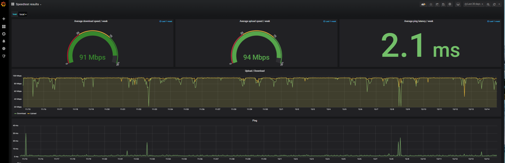

# speedtest-grafana



Docker setup consisting out of Grafana incl. a pre-configured dashboard, InfluxDB and a [speedtest.net CLI test](https://www.speedtest.net/apps/cli) runner.

Create `.env` file and adjust it at will:

```sh
grep -oP '(?<=\${).*(?=})' docker-compose.yml | sed -E -e 's/:-/=/g' -e "s/(.*)=(.*)/\1\='\2'/" > .env
```

### Grafana

#### Dashboard

By default the dashboard shows all speedtest results. To filter for a specifc host, simply add a `and host = 'local'` statement in the `WHERE` clause of the SQL select.

Example (Download Time Serie):

```SQL
SELECT mean("value") FROM "download" WHERE $timeFilter and host = 'local' GROUP BY time($interval) fill(null)
```

#### Administrative access

Access `http://${HOSTNAME}:${GRAFANA_PORT}` ([http://localhost:3000](`http://localhost:3000`) by default) and login using the following default credentials:

* Username: `admin`
* Password: `admin`


